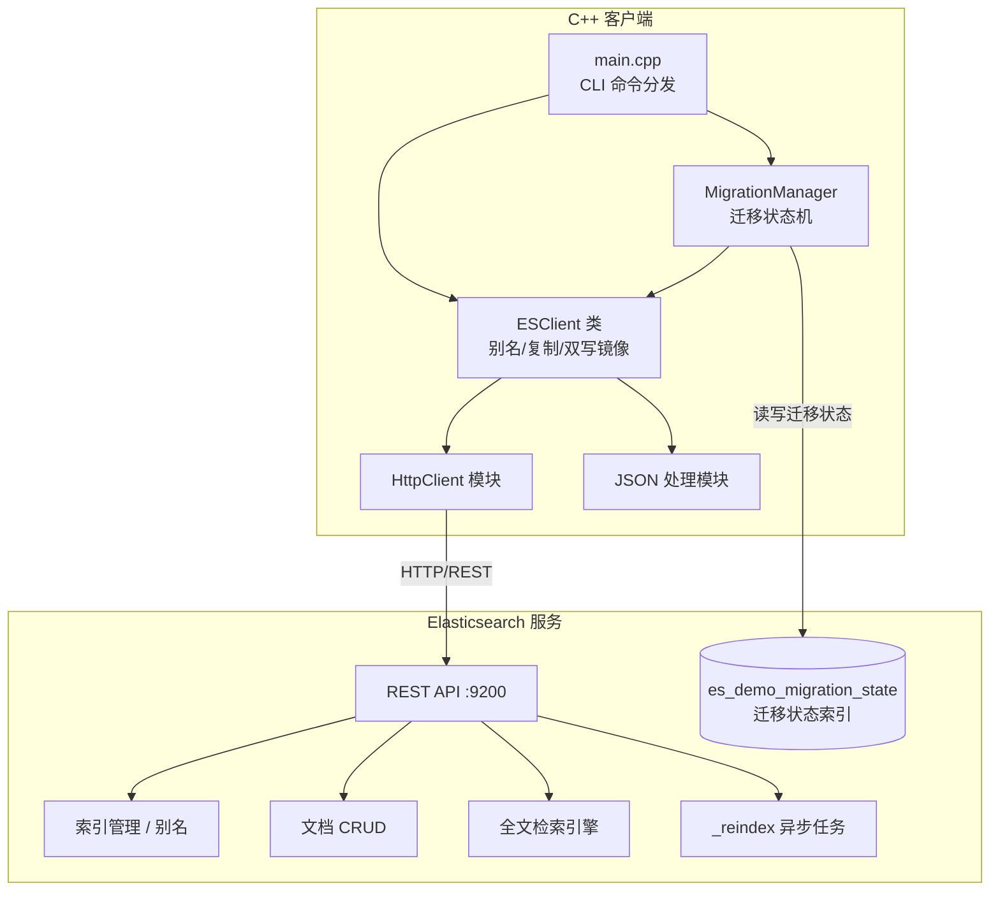
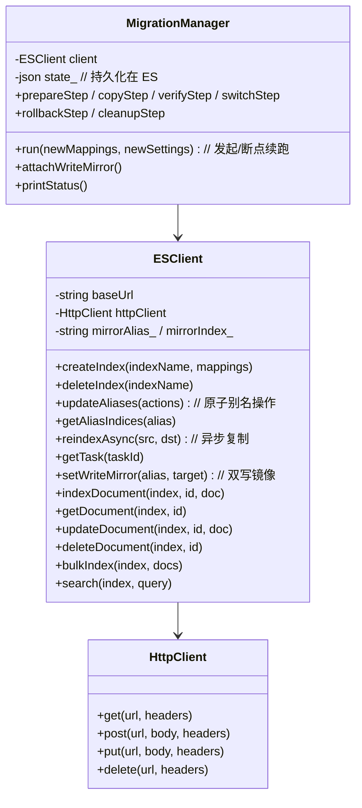

# Elasticsearch 全文检索 C++ 示例项目设计

## 1. 系统架构



## 2. 模块设计



## 3. 在线索引迁移设计

Elasticsearch 不允许直接修改既有索引的 mapping。本设计在不停止读写的前提下完成 mapping 演进，核心思想：**版本化索引 + 读写别名 + 异步复制 + 双写镜像 + 校验切换 + 状态持久化**。

### 3.1 别名与版本

- 应用只面对两个别名：`articles_read`（读）、`articles_write`（写）。
- 物理索引带版本号：`articles_v1`、`articles_v2` …
- 写别名始终只指向**一个**索引（原子切换保证），读别名同理。

### 3.2 迁移状态机（持久化在 ES）

迁移状态（迁移标识、阶段、复制任务 id、校验结论、历史）作为文档保存在 `es_demo_migration_state` 索引（doc id = 索引基名），每次推进阶段时以 `refresh=true` 落盘。进程中断后再次执行，从 ES 读取状态即可识别当前阶段并继续。

```
PREPARE → COPYING → VERIFYING → READY_TO_SWITCH → SWITCHED → CLEANED_UP
              │        │                            │
              │        └─ 校验失败 → ABORTED        └─ 回退 → ROLLED_BACK → 重新校验(VERIFYING)
              └─ 复制任务丢失 → 安全重发(create-only 幂等)
```

| 阶段            | 动作                                                                       |
| --------------- | -------------------------------------------------------------------------- |
| PREPARE         | 登记迁移（迁移标识、源/目标版本、新 mapping），计算下一版本号              |
| COPYING         | 创建目标索引；开启双写镜像；启动异步 reindex；轮询进度；任务丢失则重发     |
| VERIFYING       | 删除对齐；三项校验（映射 / 文档数量 / 复制失败项）                         |
| READY_TO_SWITCH | 校验通过，等待原子切换                                                     |
| SWITCHED        | 一次 `_aliases` 原子操作让读写别名共同转向新版本；反向镜像保回退           |
| ABORTED         | 校验失败：旧索引继续服务，流量不切换，记录原因                             |
| ROLLED_BACK     | 一次 `_aliases` 原子操作切回旧版本；正向镜像保再次切换                     |
| CLEANED_UP      | 删除旧版本，迁移终态                                                     |

### 3.3 双写镜像（复制期间不丢数据）

复制期间，写别名仍指向旧索引；客户端把经写别名到达的写操作同步镜像到新索引：

- **新增**：主索引写入成功后，用主索引返回的同一 `_id` 写入新索引（自动生成的 id 也一致）。
- **更新**：主索引更新后，**回读整篇最新文档**再整体写入新索引——避免新索引只拿到部分字段的"半文档"。
- **删除**：主索引删除后，同步删除新索引（不存在则忽略）。
- **批量**：仅镜像主索引上成功的条目。

镜像只在对**写别名**的写入上触发；直接写物理索引（如镜像自身、迁移状态索引）不会递归镜像。业务进程启动时调用 `MigrationManager::attachWriteMirrorFor(client, base)`，即可按 ES 中的迁移状态自动挂载/摘除镜像（复制期正向、切换后反向、终态关闭）。

### 3.4 复制一致性

- reindex 使用 `op_type=create` + `conflicts=proceed`：新索引中已存在的文档（双写进入的）**不被覆盖**，记为 `version_conflicts`（预期内，非失败）。
- 复制基于快照：复制期间被删除的文档可能仍被快照带入新索引（"僵尸文档"）。校验前做**删除对齐**：对比两侧文档 ID，清理新索引中多出的残留。
- 复制任务丢失（ES 重启）时，以 create-only 语义安全重发，不会覆盖双写数据。

### 3.5 校验与切换

三项校验全部通过才允许切换：

1. **映射**：目标索引 mapping 包含预期全部字段及类型（子集匹配）。
2. **文档数量**：源/目标索引 `_count` 一致。
3. **复制失败项**：reindex 响应 `failures` 为空。

切换 = 一次 `POST /_aliases`（actions 原子生效）：移除旧索引的读/写别名、添加到新索引。回退同理反向。两者都保证写别名始终只指向一个索引。

### 3.6 断点续跑

- 每个阶段推进都先持久化到 ES，再执行动作；动作均幂等（建索引前先判断存在性、复制任务复用 task_id、切换按实际别名指向计算动作）。
- 进程在任意阶段中断后，重新执行 `migrate` 会从 ES 识别阶段继续：不重复创建版本、不把流量切向半成品。
- 演示钩子：`MIGRATE_CRASH_AFTER=<阶段>` 在该阶段持久化后退出进程（退出码 2），用于验证恢复路径。

## 4. 功能清单

| 功能模块 | 功能点         | 说明                                       |
| -------- | -------------- | ------------------------------------------ |
| 索引管理 | 创建索引       | 支持自定义 mapping 和 settings             |
| 索引管理 | 删除索引       | 删除指定索引                               |
| 索引管理 | 查看索引       | 获取索引信息                               |
| 索引管理 | 读写别名       | articles_read / articles_write             |
| 在线迁移 | 版本化新索引   | 创建 articles_vN，异步 reindex             |
| 在线迁移 | 双写镜像       | 复制期间增/删/改同步到新索引               |
| 在线迁移 | 删除对齐       | 清理复制快照带入的残留文档                 |
| 在线迁移 | 三项校验       | 映射 / 文档数量 / 复制失败项               |
| 在线迁移 | 原子切换/回退  | 一次 _aliases 调用，写别名唯一             |
| 在线迁移 | 断点续跑       | 状态持久化在 ES，进程中断后恢复            |
| 文档操作 | 添加文档       | 单条/批量添加                              |
| 文档操作 | 获取文档       | 根据 ID 获取                               |
| 文档操作 | 更新文档       | 更新指定文档                               |
| 文档操作 | 删除文档       | 删除指定文档                               |
| 全文检索 | Match 查询     | 分词匹配查询                               |
| 全文检索 | Term 查询      | 精确匹配查询                               |
| 全文检索 | Bool 查询      | 组合条件查询                               |
| 全文检索 | 高亮显示       | 搜索结果高亮                               |
| 全文检索 | 分页查询       | 支持 from/size                             |

## 5. API 接口设计

### 5.1 索引与别名

- `PUT /{index}` - 创建索引
- `DELETE /{index}` - 删除索引
- `GET /{index}` - 获取索引信息
- `GET /_alias/{alias}` - 查询别名指向
- `POST /_aliases` - 原子批量别名操作（迁移切换/回退）

### 5.2 异步复制

- `POST /_reindex?wait_for_completion=false` - 异步复制（返回任务 id）
- `GET /_tasks/{taskId}` - 查询复制进度/结果

### 5.3 文档操作

- `POST /{index}/_doc/{id}` - 添加/更新文档
- `GET /{index}/_doc/{id}` - 获取文档
- `DELETE /{index}/_doc/{id}` - 删除文档
- `POST /{index}/_bulk` - 批量操作

### 5.4 搜索接口

- `POST /{index}/_search` - 搜索文档

## 6. 技术选型

| 组件        | 技术          | 版本  |
| ----------- | ------------- | ----- |
| 编程语言    | C++           | 17    |
| HTTP 客户端 | libcurl       | 7.x   |
| JSON 库     | nlohmann/json | 3.x   |
| 搜索引擎    | Elasticsearch | 8.x   |
| 构建工具    | CMake         | 3.16+ |
| 容器化      | Docker        | 20.x  |

## 7. 目录结构

```
es-cpp-demo/
├── backend/
│   ├── CMakeLists.txt
│   ├── Dockerfile
│   ├── include/
│   │   ├── es_client.hpp
│   │   ├── migration_manager.hpp
│   │   ├── http_client.hpp
│   │   └── json.hpp
│   ├── src/
│   │   ├── main.cpp
│   │   ├── es_client.cpp
│   │   ├── migration_manager.cpp
│   │   └── http_client.cpp
│   └── data/
│       └── sample_data.json
├── docker-compose.yml
├── .gitignore
├── README.md
└── docs/
    └── project_design.md
```
