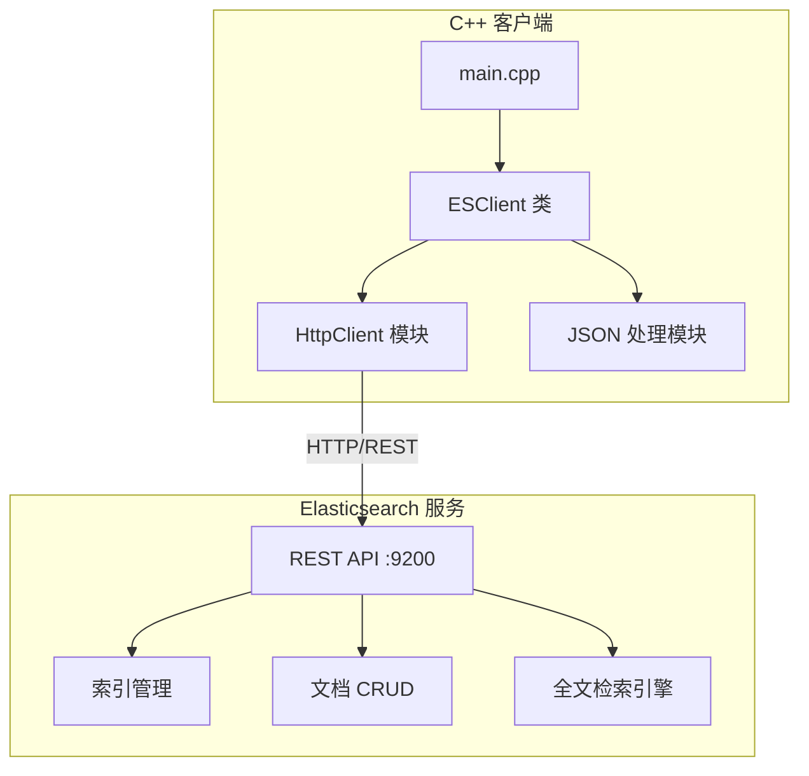
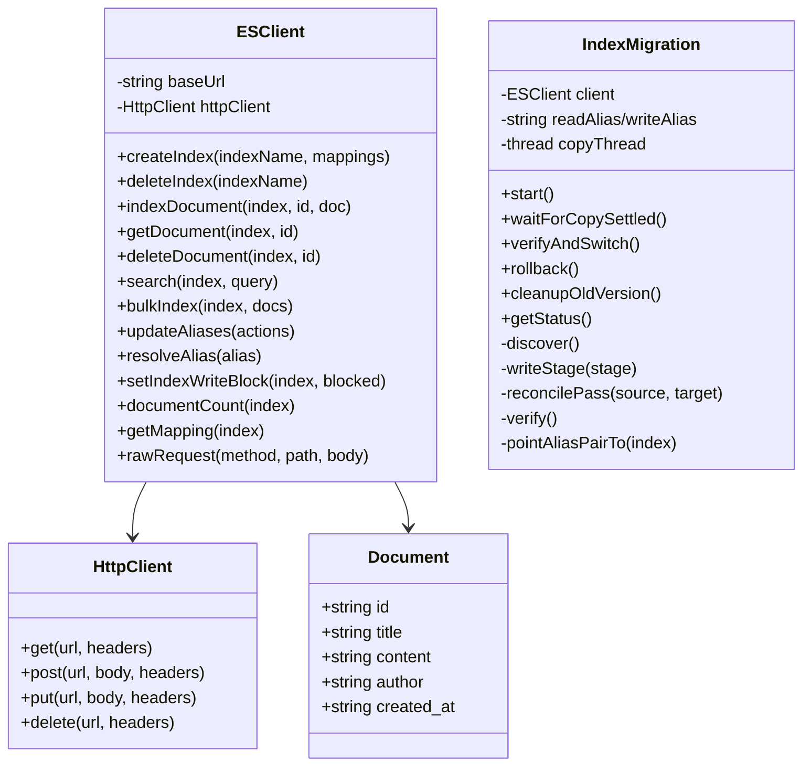
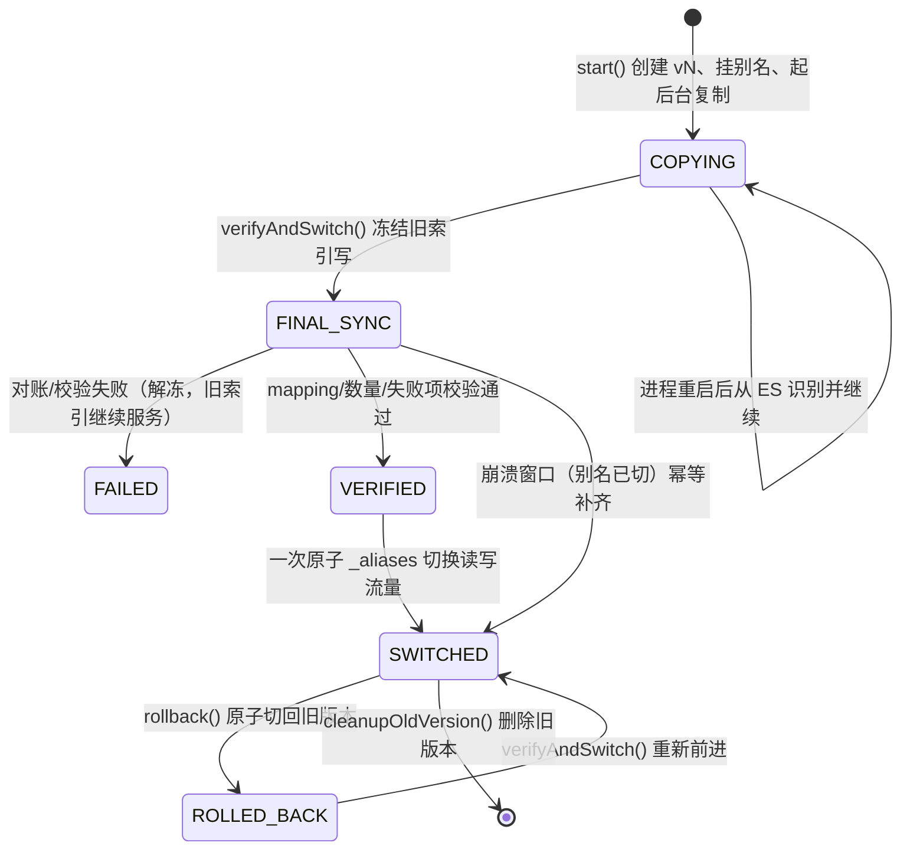

# Elasticsearch 全文检索 C++ 示例项目设计

## 1. 系统架构



## 2. 模块设计



## 3. 功能清单

| 功能模块 | 功能点     | 说明                           |
| -------- | ---------- | ------------------------------ |
| 索引管理 | 创建索引   | 支持自定义 mapping 和 settings |
| 索引管理 | 删除索引   | 删除指定索引                   |
| 索引管理 | 查看索引   | 获取索引信息                   |
| 文档操作 | 添加文档   | 单条/批量添加                  |
| 文档操作 | 获取文档   | 根据 ID 获取                   |
| 文档操作 | 更新文档   | 更新指定文档                   |
| 文档操作 | 删除文档   | 删除指定文档                   |
| 全文检索 | Match 查询 | 分词匹配查询                   |
| 全文检索 | Term 查询  | 精确匹配查询                   |
| 全文检索 | Bool 查询  | 组合条件查询                   |
| 全文检索 | 高亮显示   | 搜索结果高亮                   |
| 全文检索 | 分页查询   | 支持 from/size                 |

## 4. API 接口设计

### 4.1 索引管理

- `PUT /{index}` - 创建索引
- `DELETE /{index}` - 删除索引
- `GET /{index}` - 获取索引信息

### 4.2 文档操作

- `POST /{index}/_doc/{id}` - 添加/更新文档
- `GET /{index}/_doc/{id}` - 获取文档
- `DELETE /{index}/_doc/{id}` - 删除文档
- `POST /{index}/_bulk` - 批量操作

### 4.3 搜索接口

- `POST /{index}/_search` - 搜索文档

### 4.4 迁移相关接口

- `POST /_aliases` - 原子别名操作（一次请求内多组 add/remove）
- `PUT /{index}/_settings` - 设置 `index.blocks.write` 冻结写入
- `GET /{index}/_mapping` / `PUT /{index}/_mapping` - 读写 mapping（含 `_meta` 阶段状态）
- `POST /{index}/_search?scroll=...` + `POST /_search/scroll` - 分批滚动复制
- `POST /_bulk` - 幂等 index/delete 对账
- `GET /{index}/_count` - 文档数量校验

## 4A. 可恢复在线索引迁移

### 状态机



阶段、迁移标识、旧版本名持久化在新版本索引 mapping 的 `_meta` 中；进程任何时刻中断，重启后仅凭 Elasticsearch 即可识别阶段并继续，不重复建版本、不把流量切向半成品。

### 正确性要点

- 写别名全程唯一（`is_write_index=true`），切换与回退都是单次原子 `_aliases` 调用。
- 后台复制为幂等对账（按 `_id` 覆盖 + 删除源中不存在项），每轮先 refresh 再对账。
- 切换前冻结旧索引、refresh、最终对账、三项校验（失败项/数量/mapping，并逐 id 比对 `_source`）。

## 5. 技术选型


| 组件        | 技术          | 版本  |
| ----------- | ------------- | ----- |
| 编程语言    | C++           | 17    |
| HTTP 客户端 | libcurl       | 7.x   |
| JSON 库     | nlohmann/json | 3.x   |
| 搜索引擎    | Elasticsearch | 8.x   |
| 构建工具    | CMake         | 3.16+ |
| 容器化      | Docker        | 20.x  |

## 6. 目录结构

```
es-cpp-demo/
├── backend/
│   ├── CMakeLists.txt
│   ├── Dockerfile
│   ├── include/
│   │   ├── es_client.hpp
│   │   ├── http_client.hpp
│   │   └── json.hpp
│   ├── src/
│   │   ├── main.cpp
│   │   ├── es_client.cpp
│   │   └── http_client.cpp
│   └── data/
│       └── sample_data.json
├── docker-compose.yml
├── .gitignore
├── README.md
└── docs/
    └── project_design.md
```
